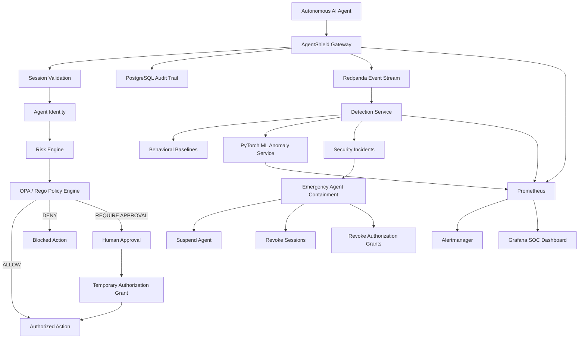
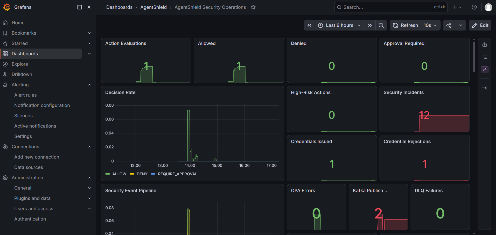
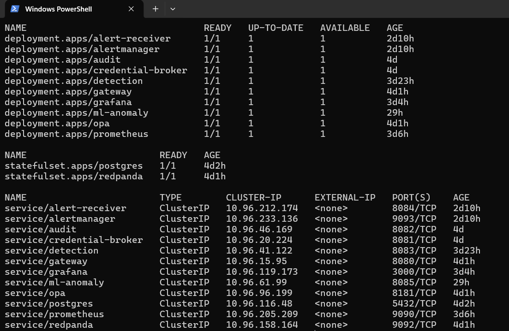
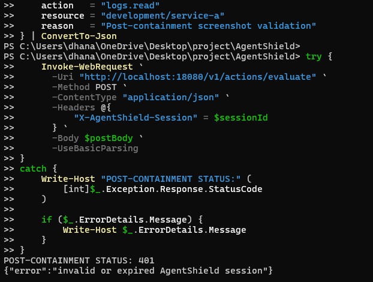

# AgentShield
[](https://github.com/Dhananjay2799/agentshield/actions/workflows/ci.yml)
[](https://github.com/Dhananjay2799/agentshield/actions/workflows/gateway-security-ci.yml)
[](https://github.com/Dhananjay2799/agentshield/actions/workflows/kubernetes-ci.yml)

### Zero-Trust Security Control Plane for Autonomous AI Agents

AgentShield is a cloud-native security control plane designed to govern autonomous AI agents before they interact with sensitive infrastructure, credentials, APIs, databases, and production systems.

Instead of treating an AI agent as a permanently trusted application, AgentShield treats every agent action as a security decision.

Each request is evaluated using agent identity, short-lived sessions, contextual risk, policy-as-code, human approval, temporary authorization grants, behavioral analytics, and neural anomaly detection.

---

## Why AgentShield?

Traditional identity and access-management systems were designed primarily for humans and relatively predictable applications.

Autonomous AI agents introduce a different security problem.

An agent may:

- perform thousands of actions autonomously;
- interact with infrastructure, databases, secrets, and APIs;
- change behavior during the lifetime of a session;
- request privileges dynamically;
- become compromised or behave unexpectedly;
- require immediate containment without shutting down the entire platform.

AgentShield provides a security layer between autonomous agents and protected resources.

The core principle is:

> Never permanently trust an autonomous agent. Continuously verify its identity, session, policy authorization, risk, and behavior.

---

## Architecture



---

## Core Security Capabilities

### Agent Identity and Sessions

AgentShield maintains identities for autonomous agents and issues short-lived execution sessions.

Sessions can expire or be explicitly revoked, and suspended agents cannot create new sessions.

### Context-Aware Authorization

Every protected action passes through the Gateway.

AgentShield evaluates:

- agent identity;
- session validity;
- requested action;
- requested resource;
- environment;
- contextual risk;
- OPA/Rego policy;
- temporary grants;
- approval state.

The final decision is one of:

```text
ALLOW
DENY
REQUIRE_APPROVAL
```

### Policy-as-Code

Authorization policies are evaluated using Open Policy Agent and Rego.

Policies are version-controlled and automatically testable.

### Human-in-the-Loop Approval

High-risk operations can require human approval instead of being permanently allowed or denied.

Approved requests can receive temporary authorization grants rather than permanent privileges.

### Just-in-Time Credential Broker

AgentShield includes a credential broker for issuing short-lived credentials to authorized workloads.

Long-lived application secrets are therefore kept out of autonomous agent workflows wherever possible.

### Immutable Security Audit Trail

Security decisions and control-plane operations are persisted in PostgreSQL.

Audit records capture information including:

```text
agent
session
action
resource
decision
risk
policy evaluation
authorization grants
approval state
containment events
timestamps
metadata
```

### Event-Driven Security Pipeline

Security events are published through Redpanda using Kafka-compatible APIs.

The Detection service consumes these events asynchronously to identify suspicious agent behavior.

### Behavioral Detection

AgentShield tracks behavioral signals such as:

- denied-action repetition;
- high-risk action repetition;
- action bursts;
- action diversity;
- resource diversity;
- behavioral deviation from historical agent baselines.

Per-agent behavioral profiles are persisted and continuously updated.

### Neural Anomaly Detection

AgentShield includes a Python/PyTorch anomaly-detection service based on an autoencoder.

Behavioral windows are converted into feature vectors and scored using reconstruction error.

The ML subsystem includes:

- model training;
- model version metadata;
- dataset hashing;
- anomaly thresholds;
- inference API;
- readiness checks;
- model metadata API;
- behavioral-drift detection;
- Prometheus metrics;
- Grafana visualization.

ML inference is intentionally not part of the authoritative authorization path.

If the neural service is unavailable, deterministic and adaptive security detection continues operating.

### Model Drift Detection

AgentShield monitors whether live behavior begins to diverge from the model's expected operating distribution.

The ML service exposes metrics for:

```text
drift score
anomaly rate
mean anomaly score ratio
drift sample count
active drift state
```

These signals are exposed through Prometheus and visualized in Grafana.

### Emergency Agent Containment

Authorized administrators can immediately contain a suspicious autonomous agent.

Containment atomically:

```text
suspends the agent identity
revokes active sessions
revokes active authorization grants
persists a permanent audit record
publishes a security control-plane event
```

After containment:

```text
new sessions are rejected
existing sessions become invalid
future actions using revoked sessions are rejected
```

Containment is idempotent and safe to execute repeatedly.

---

## Fail-Safe and Failure-Resilience Design

AgentShield explicitly tests dependency failures instead of assuming every service will remain available.

### OPA Failure

OPA is part of the authoritative authorization path.

If the policy engine becomes unavailable, AgentShield fails closed rather than silently allowing the request.

```text
OPA unavailable
      ↓
HTTP 503
      ↓
No authorization bypass
```

### ML Failure

The PyTorch model provides an additional detection signal but is not authoritative for access control.

```text
ML unavailable
      ↓
Inference failure recorded
      ↓
Adaptive/deterministic detection continues
      ↓
Gateway remains operational
```

### Kafka / Redpanda Failure

Kafka-compatible event delivery is intentionally separated from authoritative security state.

A broker outage does not undo a completed containment transaction.

Kafka publication is bounded using explicit contexts:

```text
normal security event     ≈ 1 second maximum publish window
containment event         ≈ 500 ms maximum publish window
```

During failure-injection testing, emergency containment latency improved from approximately:

```text
7.25 seconds
```

to:

```text
0.61 seconds
```

while the agent was still successfully suspended, its session revoked, and the permanent audit event persisted.

Kafka publication failures are exported as Prometheus metrics.

---

## Observability and SOC Operations

AgentShield includes a complete local security-observability stack:

- Prometheus
- Alertmanager
- Grafana
- AgentShield alert receiver
- service health metrics
- authorization metrics
- behavioral detection metrics
- anomaly metrics
- ML inference metrics
- model-drift metrics
- containment metrics
- Kafka failure metrics

The Grafana security-operations dashboard provides visibility into authorization decisions, incidents, behavioral anomalies, neural anomalies, model drift, and emergency containment activity.

## Demo Evidence

### Security Operations Dashboard

AgentShield includes a SOC-style Grafana dashboard for authorization decisions, incidents, behavioral detections, neural anomaly activity, model drift, containment, and service-health signals.



### Cloud-Native Runtime

AgentShield runs as a distributed Kubernetes workload with independent authorization, audit, credential, detection, ML, policy, messaging, database, and observability components.



---

## Zero-Trust Kubernetes Networking

AgentShield runs with Kubernetes NetworkPolicies using a default-deny model.

Explicit policies control communication among:

```text
Gateway
PostgreSQL
OPA
Redpanda
Audit
Detection
Credential Broker
ML Anomaly Service
Prometheus
Grafana
Alertmanager
Alert Receiver
```

The Kubernetes workloads also use production-oriented controls including probes, resource requests/limits, non-root execution, capability dropping, seccomp profiles, and read-only filesystems where applicable.

### Emergency Agent Containment

AgentShield can immediately suspend a compromised autonomous agent, revoke its active execution sessions, preserve audit evidence, and reject subsequent requests from the revoked session.



---

## Technology Stack

| Area | Technologies |
|---|---|
| Core services | Go |
| ML service | Python, FastAPI, PyTorch |
| Policy engine | Open Policy Agent, Rego |
| Database | PostgreSQL |
| Event streaming | Redpanda / Kafka API |
| Containers | Docker |
| Orchestration | Kubernetes, Kustomize |
| Observability | Prometheus, Grafana, Alertmanager |
| Security | Zero Trust, RBAC, policy-as-code, NetworkPolicy |
| CI/CD | GitHub Actions |
| Testing | Go test, pytest, Rego tests, promtool, Kubernetes dry-run |

---

## Repository Structure

```text
AgentShield/
├── .github/
│   └── workflows/
│
├── docs/
│
├── infrastructure/
│   ├── docker/
│   ├── kubernetes/
│   │   ├── base/
│   │   │   ├── audit/
│   │   │   ├── credential-broker/
│   │   │   ├── detection/
│   │   │   ├── gateway/
│   │   │   ├── jobs/
│   │   │   ├── ml-anomaly/
│   │   │   ├── networking/
│   │   │   ├── observability/
│   │   │   ├── opa/
│   │   │   ├── postgres/
│   │   │   └── redpanda/
│   │   └── overlays/
│   │
│   └── terraform/
│
├── policies/
│   ├── agentshield.rego
│   └── agentshield_test.rego
│
└── services/
    ├── alert-receiver/
    ├── audit/
    ├── credential-broker/
    ├── detection/
    ├── gateway/
    └── ml-anomaly/
```

---

## Security Regression Testing

AgentShield includes automated tests for important security invariants.

Examples include:

```text
containment suspends an agent
active sessions are revoked
containment is idempotent
unknown agents cannot be contained
suspended agents cannot create sessions
Kafka publishing honors context deadlines
behavioral feature extraction
adaptive baseline behavior
detection-engine behavior
ML client timeout/error handling
ML API behavior
model metadata
behavioral drift
```

The project also includes manual failure-injection validation for:

```text
OPA outage
ML inference outage
Kafka / Redpanda outage
concurrent session creation during containment
post-containment session reuse
RBAC abuse attempts
```

---

## CI/CD

GitHub Actions workflows validate multiple layers of AgentShield:

```text
.github/workflows/ci.yml
.github/workflows/gateway-security-ci.yml
.github/workflows/kubernetes-ci.yml
```

The pipeline is designed to catch application, security-policy, and Kubernetes configuration regressions before deployment.

---

## Local Kubernetes Deployment

AgentShield can be rendered using Kustomize:

```bash
kubectl kustomize infrastructure/kubernetes/base
```

Validate the rendered manifests:

```bash
kubectl kustomize infrastructure/kubernetes/base > agentshield.yaml
kubectl apply --dry-run=client -f agentshield.yaml
```

Apply:

```bash
kubectl apply -f agentshield.yaml
```

Inspect workloads:

```bash
kubectl get pods -n agentshield
```

---

## Project Status

AgentShield currently implements the core control-plane, authorization, behavioral-security, ML-security, containment, Kubernetes, and observability architecture.

The project is being completed as a production-style security engineering portfolio system rather than a minimal demonstration application.

---

## Engineering Focus

AgentShield demonstrates work across:

**AI security · Backend engineering · Distributed systems · Zero Trust · Machine learning · DevSecOps · Kubernetes · Event-driven architecture · Policy-as-code · Observability · Reliability engineering**

---

## Disclaimer

AgentShield is an engineering and security research portfolio project. It should undergo additional threat modeling, penetration testing, infrastructure review, secret-management integration, and production-scale validation before deployment in a real production environment.

## Documentation

For deeper technical details:

- [Architecture](docs/architecture.md)
- [Security Model](docs/security-model.md)
- [Demo Guide](docs/demo.md)
- [Deployment & Operations](docs/deployment.md)