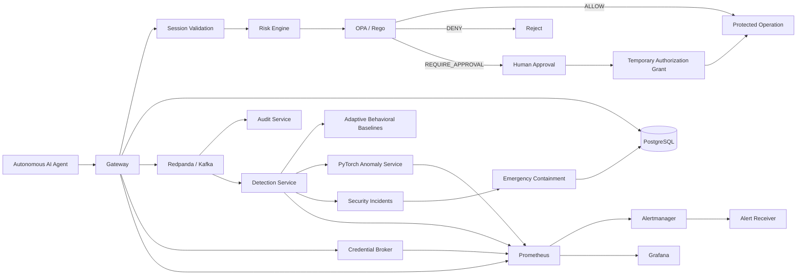
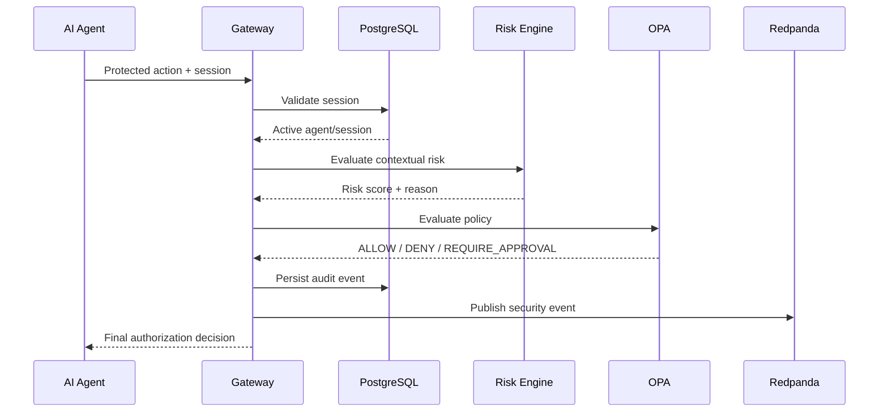
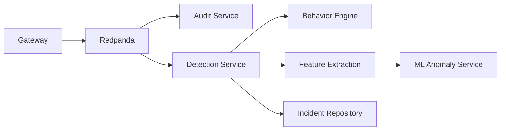
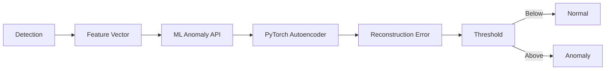
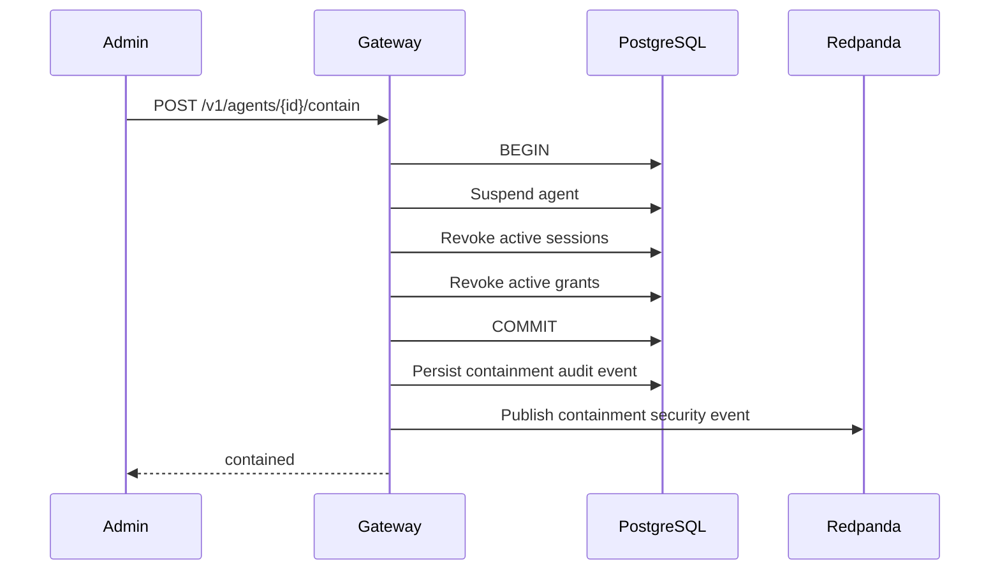
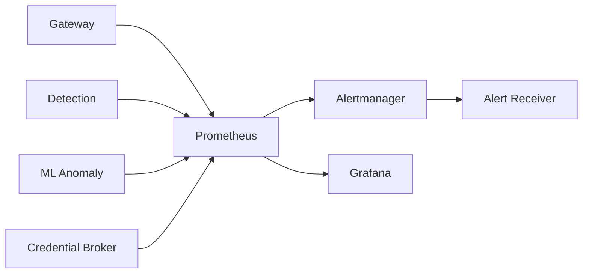

# AgentShield Architecture


## Overview


AgentShield is a distributed zero-trust security control plane for autonomous AI agents.


Its architecture separates four major responsibilities:


1. **Authorization** — determine whether an agent action is permitted.

2. **Credential access** — issue short-lived credentials only after authorization.

3. **Detection** — observe behavior and identify suspicious activity.

4. **Containment** — immediately disable a compromised or unsafe agent.


The design intentionally separates authoritative security decisions from asynchronous analytics so failures in telemetry or machine learning cannot bypass access control.


---


## System Architecture





---


## Request Authorization Flow


Every protected agent request enters AgentShield through the Gateway.





The Gateway performs the following logical stages:


```text

Request

 ↓

Session validation

 ↓

Agent identity validation

 ↓

Contextual risk evaluation

 ↓

OPA/Rego policy evaluation

 ↓

Temporary grant / approval evaluation

 ↓

Final decision

 ↓

Audit persistence

 ↓

Security-event publication

```


---


## Agent Identity and Sessions


Agents are persisted in PostgreSQL with lifecycle state such as:


```text

active

suspended

```


Execution occurs through short-lived agent sessions.


A session contains:


```text

agent identity

task identity

session status

start time

expiration time

termination time

```


Security operations can revoke sessions before their natural expiration.


A suspended agent is not allowed to create new sessions.


---


## Risk Engine


The Gateway calculates contextual risk before policy evaluation.


Risk signals can include:


- requested action;

- protected resource;

- execution environment;

- action sensitivity;

- agent context;

- prior authorization conditions.


The risk result becomes input to the policy layer and audit trail.


---


## Policy Engine


Authorization policy is evaluated using Open Policy Agent and Rego.


OPA operates as an authoritative security dependency.


The policy engine can return:


```text

ALLOW

DENY

REQUIRE_APPROVAL

```


OPA policy rules are stored in:


```text

policies/agentshield.rego

```


and policy regression tests in:


```text

policies/agentshield_test.rego

```


### Failure Boundary


AgentShield does not bypass policy evaluation when OPA is unavailable.


```text

Gateway

  ↓

OPA unavailable

  ↓

Policy evaluation cannot be completed

  ↓

HTTP 503

  ↓

Request is not authorized

```


This is a deliberate fail-closed boundary.


---


## Human Approval and Temporary Grants


Not every elevated action needs to be permanently allowed or permanently denied.


AgentShield supports a human-in-the-loop path:


```text

Agent request

  ↓

REQUIRE_APPROVAL

  ↓

Human review

  ↓

Approval

  ↓

Temporary authorization grant

  ↓

Authorized execution

```


Temporary grants reduce the need for permanently elevated privileges.


---


## Credential Broker


The Credential Broker handles short-lived credential issuance.


The high-level flow is:


```text

Agent

 ↓

Gateway authorization

 ↓

Credential Broker

 ↓

Short-lived signed credential

```


The broker validates authorization state before issuing credentials and uses dedicated service authentication when communicating with the Gateway.


This separates credential issuance from the main request-policy path.


---


## Security Event Pipeline


Authorization activity is persisted and also published into the security-event stream.





The event pipeline allows security analytics to operate asynchronously without blocking the authoritative authorization path indefinitely.


---


## Detection Service


The Detection service consumes security events from Redpanda.


It evaluates several classes of suspicious behavior, including:


- repeated denied actions;

- repeated high-risk actions;

- action bursts;

- action diversity;

- resource diversity;

- deviation from persisted behavioral baselines;

- neural anomaly predictions.


Detection results can create security incidents.


---


## Adaptive Behavioral Baselines


AgentShield maintains per-agent behavioral profiles.


The Detection service tracks features over time and updates behavioral baselines after sufficient observations.


Conceptually:


```text

Live event

  ↓

Feature extraction

  ↓

Current behavioral vector

  ↓

Historical agent profile

  ↓

Anomaly comparison

  ↓

Updated baseline

```


Profiles are persisted in PostgreSQL so behavioral history survives Detection service restarts.


---


## ML Anomaly Detection


AgentShield includes a dedicated Python/FastAPI/PyTorch service.


The current model is an autoencoder trained to reconstruct expected behavioral feature vectors.


### Features


The ML input currently contains eight behavioral dimensions:


```text

event count

deny ratio

high-risk ratio

action diversity ratio

resource diversity ratio

average risk score

production-access ratio

sensitive-action ratio

```


### Inference





The service returns information such as:


```text

reconstruction_error

threshold

score_ratio

is_anomaly

model version

```


---


## Model Lifecycle


The ML subsystem also tracks model metadata.


Examples include:


```text

model name

model version

model type

training sample count

validation sample count

anomaly test count

feature count

threshold

training data SHA-256

```


The dataset hash provides traceability between a model artifact and the data used to produce it.


---


## Model Drift Detection


A model can become less representative as real agent behavior changes.


AgentShield therefore tracks a rolling inference window and calculates drift-related signals.


```text

recent prediction window

       ↓

mean score ratio

anomaly rate

sample count

       ↓

drift score

       ↓

drift active / inactive

```


These values are exported as Prometheus metrics and visualized through Grafana.


---


## ML Failure Boundary


Machine learning is not authoritative for access-control decisions.


If the ML service becomes unavailable:


```text

ML inference request

      ↓

timeout / failure

      ↓

failure metric incremented

      ↓

deterministic detection continues

      ↓

adaptive baseline continues

```


This prevents the neural component from becoming a single point of failure.


---


## Emergency Agent Containment


Containment provides a kill switch for suspicious autonomous agents.


An administrator calls the Gateway containment API.


The repository performs containment inside a PostgreSQL transaction.





After the transaction commits:


```text

agent.status = suspended


active sessions

   → revoked


active authorization grants

   → revoked

```


A contained agent cannot obtain a new session, and previously revoked sessions cannot authorize new actions.


---


## Containment Idempotency


Containment is intentionally safe to repeat.


Example:


```text

First containment:

sessions revoked = 3


Second containment:

sessions revoked = 0


Agent remains suspended.

```


No privileges are restored by repeated containment.


---


## Containment and Behavioral Learning


Containment events are control-plane events.


They are deliberately excluded from behavioral-baseline and ML learning.


Otherwise administrative security operations could contaminate an agent's normal behavioral profile.


The Detection service therefore recognizes:


```text

event_type = agent.contained

action     = agent.contain

```


and records the control-plane event without using it for behavioral learning.


---


## Kafka Failure Boundary


Redpanda provides asynchronous security-event delivery but does not own authoritative security state.


The Gateway uses bounded Kafka publication contexts.


Current limits:


```text

normal action event:

1 second


containment event:

500 milliseconds

```


If Kafka is unavailable:


```text

database security decision succeeds

       ↓

audit state remains authoritative

       ↓

Kafka publish times out

       ↓

failure metric increments

       ↓

request completes

```


### Failure-Injection Result


Before bounded publishing:


```text

Kafka outage containment latency:

approximately 7.25 seconds

```


After hardening:


```text

Kafka outage containment latency:

approximately 0.61 seconds

```


The agent was still suspended and the active session revoked.


---


## PostgreSQL Security Boundary


PostgreSQL stores authoritative state for:


- agents;

- sessions;

- approvals;

- authorization grants;

- policies;

- audit events;

- incidents;

- behavioral profiles.


Containment updates are performed transactionally so the agent cannot be left intentionally half-contained by a normal application error between state mutations.


---


## Observability Architecture


AgentShield exposes service and security metrics to Prometheus.





Security telemetry includes:


```text

authorization decisions

risk events

Kafka publication failures

behavioral detections

security incidents

ML predictions

ML anomalies

ML inference failures

ML windows skipped

model drift

containment events

```


---


## Grafana Security Operations Dashboard


The AgentShield Grafana dashboard provides SOC-style visualization for:


- authorization activity;

- risk decisions;

- incidents;

- behavioral detections;

- adaptive anomaly activity;

- ML prediction volume;

- neural anomalies;

- ML failures;

- ML window gating;

- model drift;

- containment activity.


---


## Alerting


Prometheus alert rules cover operational and security signals.


Examples include:


```text

ML behavior anomaly detected

ML inference failures

high ML anomaly rate

model drift

agent containment executed

```


Alertmanager routes alerts to the AgentShield alert receiver.


---


## Kubernetes Architecture


AgentShield uses Kustomize-managed Kubernetes resources.


Major workloads include:


```text

Gateway

Audit

Credential Broker

Detection

ML Anomaly

OPA

PostgreSQL

Redpanda

Prometheus

Grafana

Alertmanager

Alert Receiver

```


Initialization jobs create database migrations and Redpanda topics.


---


## Network Isolation


The namespace uses a default-deny NetworkPolicy model.


Communication is then explicitly permitted only where required.


Examples:


```text

Gateway → PostgreSQL

Gateway → OPA

Gateway → Redpanda


Detection → PostgreSQL

Detection → Redpanda

Detection → ML Anomaly


Prometheus → monitored services


Grafana → Prometheus


Alertmanager → Alert Receiver

```


This creates an application-level zero-trust network model rather than unrestricted east-west connectivity.


---


## Kubernetes Workload Hardening


Where supported, workloads use controls including:


```text

runAsNonRoot

fixed non-root UID/GID

allowPrivilegeEscalation: false

drop ALL Linux capabilities

RuntimeDefault seccomp profile

readOnlyRootFilesystem

resource requests

resource limits

startup probes

readiness probes

liveness probes

```


---


## Reliability Principles


AgentShield follows several explicit reliability rules.


### 1. Authorization fails closed


OPA failure cannot become implicit permission.


### 2. ML fails soft


Neural inference failure does not stop deterministic enforcement or detection.


### 3. Telemetry does not own security state


Kafka failure cannot undo successful containment.


### 4. Emergency control is bounded


Containment does not wait indefinitely for telemetry delivery.


### 5. Security operations are auditable


Containment and authorization activity remain permanently recorded in PostgreSQL.


### 6. Administrative events do not poison ML behavior


Control-plane events are excluded from learning pipelines.


---


## Security Regression Tests


Automated regression coverage protects important invariants.


Repository tests verify:


```text

containment suspends agents

active sessions are revoked

containment is idempotent

unknown agents return ErrAgentNotFound

suspended agents cannot create sessions

```


Kafka tests verify that unavailable broker publishing respects context deadlines.


Detection and ML services contain additional tests for:


```text

behavior engine

behavior tracking

baseline profiles

feature extraction

ML client

prediction API

model metadata

model drift

```


---


## CI Boundaries


AgentShield uses multiple GitHub Actions workflows rather than one monolithic pipeline.


```text

ci.yml

gateway-security-ci.yml

kubernetes-ci.yml

```


This allows application, security, and infrastructure validation to evolve independently.


---


## Design Tradeoffs


### Synchronous audit, asynchronous telemetry


Security state is persisted before relying on event-stream processing.


### Separate ML service


PyTorch runs independently from Go authorization services, keeping the authorization path lightweight and preventing ML runtime dependencies from entering the Gateway.


### PostgreSQL-backed state


The project favors durable, inspectable security state over in-memory-only authorization decisions.


### Kafka-compatible Redpanda


Redpanda provides the distributed event architecture while remaining compatible with Kafka client semantics.


---


## Future Production Work


Before use in a real production environment, additional work would include:


- managed secret storage;

- mTLS between services;

- workload identities;

- distributed tracing;

- horizontal autoscaling;

- multi-node Redpanda/PostgreSQL topology;

- formal penetration testing;

- advanced model registry;

- automated model promotion/rollback;

- external identity-provider integration;

- cloud deployment and disaster-recovery testing.


These are intentionally separated from the core portfolio implementation so the repository clearly distinguishes implemented functionality from future production extensions.


